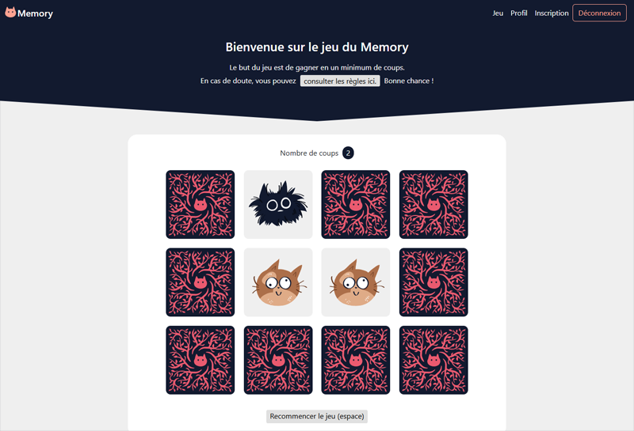
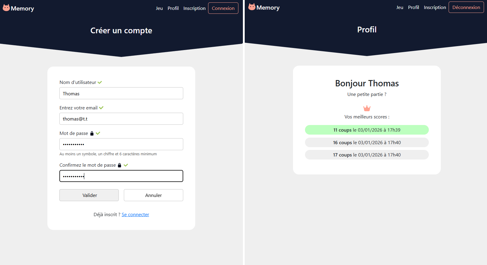

# Jeu du Memory - Projet d'école

## Description

Ce projet est un **Jeu de Memory développé de A à Z** dans le cadre d'un exercice scolaire.  
Le but du projet était de créer un jeu interactif en HTML, CSS et JavaScript, tout en simulant une base de données avec le **localStorage**.

Fonctionnalités principales :  
- Jeu interactif avec cartes illustrées, dos et motifs créés spécialement pour ce projet. 
- Inscription et validation des utilisateurs avec contrôle des champs en JavaScript.  
- Connexion des utilisateurs inscrits.  
- Page de profil pour chaque utilisateur connecté avec affichage des **10 meilleurs scores**.  
- Scores enregistrés avec nombre de coups, date et heure.  
 

> ⚠️ Remarque : Les mots de passe sont stockés en clair dans le localStorage.  
> C'est volontaire dans le cadre de l’exercice, mais ils devraient évidemment être hachés et sécurisés pour un projet réel.

---

## Technologies utilisées

- **HTML / CSS / JavaScript**  
- **jQuery** pour la manipulation du DOM et les événements.  
- **Bootstrap 5** pour la nav et une partie de la mise en page
- **FontAwesome** pour certaines icônes, et illustrations personnelles pour le reste.  

---

## Fonctionnalités détaillées

1. **Jeu du Memory**  
   - Grille de cartes organisée aléatoirement à chaque partie
   - Les cartes se retournent au clic et s'associent par paires.  
   - Comptage du nombre de coups.  
   - Score ajouté automatiquement à l’historique de l’utilisateur connecté.  

2. **Inscription d’utilisateur**  
   - Validation du nom, email et mot de passe selon des regex.  
   - Vérification que le nom et l'adresse mail n’existent pas déjà dans la liste des utilisateurs inscrits.  

3. **Connexion d’utilisateur**  
   - Vérification du nom et du mot de passe associé dans le localStorage.  
   - Stockage du statut de connexion qui persiste entre pages.  

4. **Profil utilisateur**  
   - Affichage conditionnel selon que l’utilisateur soit connecté ou non.  
   - Affichage des meilleurs scores (jusqu'à 10), avec date et heure.  
   - Scores enregistrés et triés automatiquement dès lors que l'utilisateur est connecté.  

---

## Licence

Ce projet est sous **[GNU GPL v3](https://www.gnu.org/licenses/gpl-3.0.html)**.  
Les illustrations des cartes (devant et dos) sont protégées par une licence Creative Commons Attribution-NonCommercial 4.0 International (CC BY-NC 4.0). 
Une partie des icônes proviennent de FontAwesome et sont soumises à leur licence respective.  

